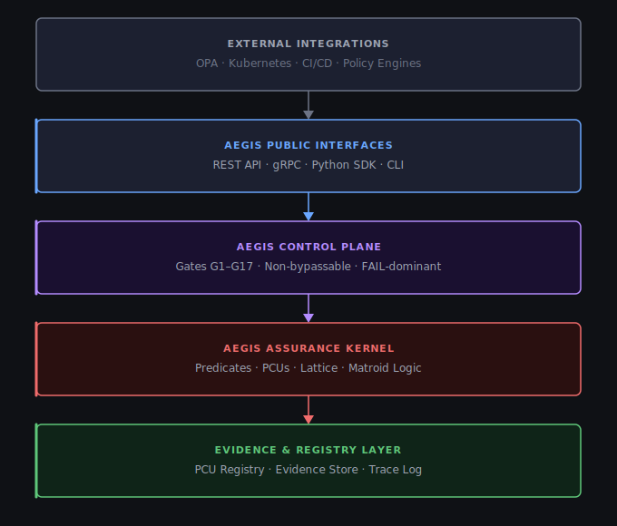

> **PATENT PENDING** — Technology and methodology patent pending. All rights reserved.

[](https://aegis.dmiruke.dev/docs#/)
[](https://aegis-dashboard.dmiruke.dev/dashboard)

# AEGIS Certify

**Deterministic AI Compliance Assurance Library**

AEGIS Certify is a mathematically-grounded AI governance system that evaluates AI artifacts against regulatory predicates using executable Primary Compute Units (PCUs), enforced through a FAIL-dominant lattice gate architecture.

---

## Live API

No installation required. The API is live and ready to use:

| Interface | URL |
|-----------|-----|
| Interactive API (Swagger UI) | https://aegis.dmiruke.dev/docs#/ |
| OpenAPI Specification | https://aegis.dmiruke.dev/openapi.json |
| Dashboard | https://aegis-dashboard.dmiruke.dev/dashboard |
| Health Check | https://aegis.dmiruke.dev/health |

### Quick API Usage

```bash
# Health check
curl https://aegis.dmiruke.dev/health

# List all research hypotheses (H1-H7)
curl https://aegis.dmiruke.dev/api/v1/hypotheses

# List all experiments
curl https://aegis.dmiruke.dev/api/v1/experiments

# List available metrics
curl https://aegis.dmiruke.dev/api/v1/metrics/available
```

### Context Graph / G16 Domain Drift Detection

```bash
# 1. Build a certified context graph
GRAPH=$(curl -s -X POST https://aegis.dmiruke.dev/api/v1/context-graph \
  -H "Content-Type: application/json" \
  -d '{
    "name": "healthcare-agent",
    "nodes": [
      {"node_id": "intake",    "domain": "healthcare", "task_type": "triage",    "agent_role": "assistant", "data_scope": ["pii","phi"], "trust_tier": 3, "label": "CERTIFIED"},
      {"node_id": "diagnosis", "domain": "healthcare", "task_type": "diagnosis", "agent_role": "assistant", "data_scope": ["phi"],       "trust_tier": 3, "label": "CERTIFIED"},
      {"node_id": "billing",   "domain": "finance",    "task_type": "billing",   "agent_role": "assistant", "data_scope": ["pii"],       "trust_tier": 2, "label": "PROVISIONAL"},
      {"node_id": "external",  "domain": "internet",   "task_type": "search",    "agent_role": "tool",      "data_scope": [],            "trust_tier": 0, "label": "FORBIDDEN"}
    ],
    "edges": [
      {"source": "intake",    "target": "diagnosis", "kind": "TRANSITION", "certified": true},
      {"source": "diagnosis", "target": "billing",   "kind": "TRANSITION", "certified": true},
      {"source": "billing",   "target": "external",  "kind": "TRANSITION", "certified": false}
    ]
  }')
GRAPH_ID=$(echo $GRAPH | python3 -c "import json,sys; print(json.load(sys.stdin)['graph_id'])")

# 2. Evaluate a path — PASS (all CERTIFIED nodes)
curl -s -X POST https://aegis.dmiruke.dev/api/v1/context-graph/evaluate \
  -H "Content-Type: application/json" \
  -d "{\"graph_id\": \"$GRAPH_ID\", \"path\": [\"intake\", \"diagnosis\"]}"
# → {"decision": "PASS", "enforcement": "NONE", ...}

# 3. Evaluate a path — WARN (hits PROVISIONAL node → HITL)
curl -s -X POST https://aegis.dmiruke.dev/api/v1/context-graph/evaluate \
  -H "Content-Type: application/json" \
  -d "{\"graph_id\": \"$GRAPH_ID\", \"path\": [\"intake\", \"diagnosis\", \"billing\"]}"
# → {"decision": "WARN", "enforcement": "HITL", ...}

# 4. Evaluate a path — FAIL (hits FORBIDDEN node → HALT)
curl -s -X POST https://aegis.dmiruke.dev/api/v1/context-graph/evaluate \
  -H "Content-Type: application/json" \
  -d "{\"graph_id\": \"$GRAPH_ID\", \"path\": [\"intake\", \"diagnosis\", \"external\"], \"hard_mode\": true}"
# → {"decision": "FAIL", "enforcement": "HALT", ...}

# 5. Validate a single node
curl -s -X POST https://aegis.dmiruke.dev/api/v1/context-graph/validate-node \
  -H "Content-Type: application/json" \
  -d "{\"graph_id\": \"$GRAPH_ID\", \"node_id\": \"external\"}"
# → {"label": "FORBIDDEN", "is_forbidden": true, ...}
```

Full interactive examples available at the Swagger UI above.

---

## Key Features

- **17-Gate Control Plane (G1-G17)**: Ordered, non-bypassable decision points
- **FAIL-Dominant Lattice**: If any PCU fails, the gate fails. No compensation, no averaging.
- **115+ Primary Compute Units (PCUs)**: Covering GDPR, EU AI Act, NIST AI RMF, SOC2, HIPAA, PCI DSS, and more
- **Unit Action Interception**: Runtime enforcement at the action level
- **Context Graph Support**: Constraint enforcement with context drift detection
- **Deterministic Evaluation**: Same inputs always produce the same outputs

## Architecture



## Quick Start

### Installation

```bash
# Clone the repository
git clone https://github.com/aegis-certify/aegis.git
cd aegis

# Create virtual environment
python -m venv .venv
source .venv/bin/activate

# Install in development mode
pip install -e ".[dev]"
```

### Basic Usage

```python
from aegis_certify import AegisClient

# Initialize client
client = AegisClient()

# Certify an AI artifact
result = client.certify(
    artifact_id="my-agent-001",
    artifact_type="agent",
    evidence={
        "gdpr_consent_collected": True,
        "data_retention_days": 30,
        "human_oversight_enabled": True
    }
)

print(f"CAI Score: {result.cai_score}")
print(f"Decision: {result.decision}")  # PERMIT, THROTTLE, or HALT
print(f"Gates Passed: {result.gates_passed}")
```

### CLI Usage

```bash
# Certify an artifact
aegis certify agent-001 --type agent --evidence evidence.json

# List all gates
aegis gates list

# Check gate status
aegis gates status G14

# Validate PCU registry completeness
aegis registry validate
```

### Docker Deployment

```bash
cd infra/docker

# Start all services
docker-compose -f docker-compose.dev.yml up -d

# Access:
# - UI Dashboard: http://localhost:10300
# - API: http://localhost:10800
# - API Docs: http://localhost:10800/docs
```

## Gate Architecture

| Gate | Domain | Enforcement |
|------|--------|-------------|
| G1 | Legal Admissibility | HALT |
| G2 | Safety | HALT / THROTTLE |
| G3 | Data Governance | HALT |
| G4 | Risk Management | THROTTLE |
| G5 | Fairness | HALT |
| G6 | Audit Evidence | HALT |
| G7 | Human Oversight | HITL |
| G8 | Continuous Monitoring | THROTTLE |
| G9 | Capability Boundary | HALT |
| G10 | Objective Integrity | HALT |
| G11 | Assurance Integrity | FAIL |
| G12 | Composition Safety | HALT |
| G13 | Autonomy Escalation | DOWNGRADE |
| G14 | Tool Boundary | VETO |
| G15 | Reversibility | BLOCK |
| G16 | Context Shift | ADVISORY |
| G17 | Termination | INADMISSIBLE |

## Core Invariants

1. **FAIL-dominant lattice**: `if any PCU == FAIL → Gate = FAIL`
2. **No LLM authority**: LLMs assist semantic analysis ONLY
3. **No aggregation**: Compliance is binary per-predicate, not scored
4. **Determinism**: Same (artifact, context, evidence) → same result
5. **Soundness**: PCU FAIL ⇒ predicate false. No false PASS allowed.

## Regulatory Frameworks Supported

- **GDPR** - EU Data Protection
- **EU AI Act** - EU AI Regulation
- **NIST AI RMF** - Risk Management Framework
- **SOC 2** - Trust Service Criteria
- **HIPAA** - Healthcare Privacy
- **PCI DSS** - Payment Card Industry
- **ISO 42001** - AI Management System
- **FDA AI/ML** - Medical Device AI
- **Agentic AI Risks (R1-R7)** - Agent-specific safety

## Project Structure

```
aegis/
├── src/aegis_certify/       # Core library
│   ├── core/                # Predicates, PCUs, Gates, Lattice, Matroid
│   ├── pcus/                # PCU implementations by framework
│   ├── api/                 # FastAPI REST endpoints
│   ├── grpc/                # gRPC service
│   ├── cli/                 # Typer CLI
│   └── sdk/                 # Python SDK clients
├── tests/                   # Unit, integration, e2e tests
├── proto/                   # gRPC protobuf definitions
├── infra/                   # Docker, Kubernetes configs
├── ui/                      # React dashboard
├── docs/                    # Documentation
└── aegis-experimental-platform/  # Evaluation scaffold
```

## Development

```bash
# Run tests
make test

# Run linting
make lint

# Format code
make format

# Generate gRPC stubs
make proto

# Validate PCU registry
make validate-registry
```

## Documentation

- [Standalone Deployment Guide](docs/STANDALONE_SANDBOX_DEPLOYMENT.md)
- [Architecture Overview](docs/STANDALONE_BLOCK_ARCHITECTURE.md)
- [Experimental Platform Plan](docs/AEGIS_EXPERIMENTAL_PLATFORM_PLAN.md)
- [CLI Architecture](docs/CLI_ARCHITECTURE_GUIDE.md)
- [Context Graph Integration](docs/CONTEXT_GRAPH_INTEGRATION_PLAN.md)

## License

Business Source License 1.1

## Version

1.0.0 (Standalone Distribution)
